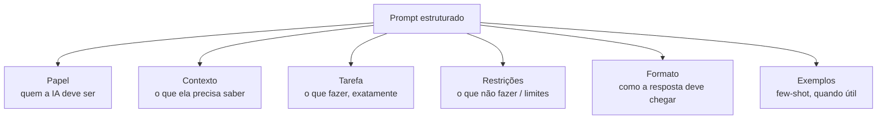
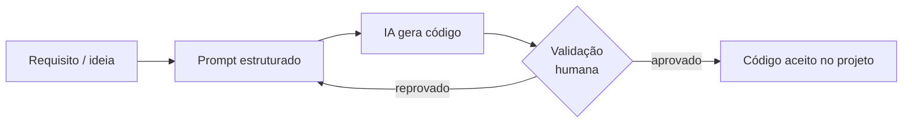
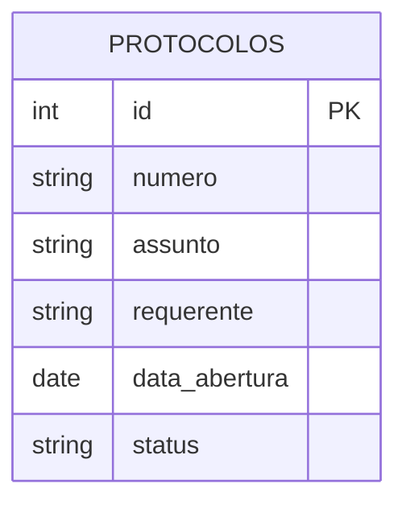
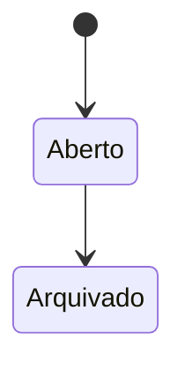

# Aula 0 · Diagramas

## 1. Anatomia de um prompt eficaz

## 2. Ciclo básico: do prompt ao código validado

Este ciclo simples é o embrião do Spec-Driven Development completo, que a Aula 1 formaliza com specs, user stories e critérios de aceitação explícitos no lugar do "requisito/ideia" solto.

## 3. Modelo de dados do SISPROT ao final da Aula 0

## 4. Estados possíveis do campo `status` (visão antecipada — detalhado na Aula 1)

> Na Aula 0, o único caminho possível é `Aberto → Arquivado` (via `encerrar.php`). Os estados intermediários (`Em Análise`, `Deferido`, `Indeferido`) e as transições entre setores são construídos na Aula 1, a partir de uma especificação formal do fluxo de tramitação.
